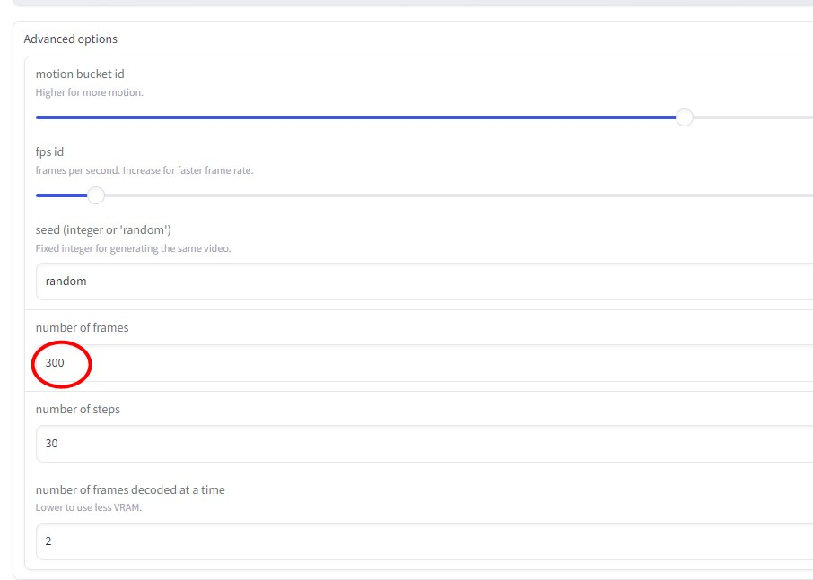

# Stable Video Diffusion img2vid unlimited length

## What it does
Based on [Stable Video Diffusion img2vid](https://github.com/sagiodev/stable-video-diffusion-img2vid)
But unlimit the length video length on low VRAM GPU like T4

## How to use
1. Open the Colab Notebook. 
2. Change the frames number.
    
